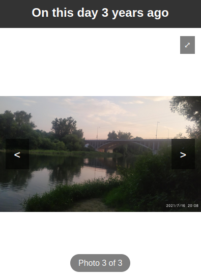

# Local Photos Rediscovery

This Flask application displays photos from your local collection that were taken on the same day in previous years.



## Installation

1. Ensure you have Python 3.7+ installed on your system.
2. Clone this repository or download the source code.
3. Navigate to the project directory in your terminal.
4. Create a virtual environment (optional but recommended)
    ```
    python -m venv venv
    source venv/bin/activate  # On Windows, use: venv\Scripts\activate
    ```
5. Install the required packages with the following command:
   ```
   pip install -r requirements.txt
   ```


## Usage

1. Run the application with the following command, replacing `[PATH_TO_PHOTOS]` with the path to your photo collection:
   ```
   python app.py [PATH_TO_PHOTOS]
   ```
   For example:
   ```
   python app.py /home/user/Pictures
   ```

2. Open a web browser and go to `http://localhost:5000`


## Notes

- If multiple years have photos from the same day, a random year is selected.


